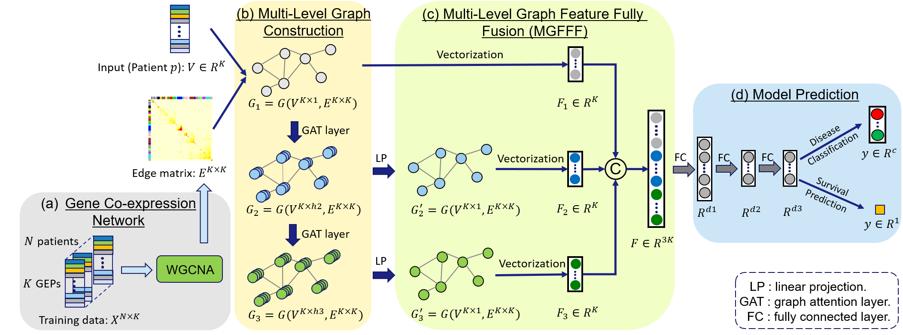

# MLA-GNN


This repository is an official PyTorch implementation of the paper 
**"Multi-Level Attention Graph Neural Network Based on Co-expression Gene Modules for Disease Diagnosis and Prognosis"
submitted to **Bioinformatics 2021**.



## Installation
### Dependencies
```
Python 3.6
PyTorch >= 1.5.0
torch_geometric
numpy
pandas
scipy
sklearn
opencv
random
```

## Data Description
For the glioma dataset, 15-fold cross validation is conducted to evaluate the model performance. For each train-test split, we compute the adjacency matrix by performing the WGCNA algorithm on the training set. The **input features and adjacency matrix** are saved at: ./example_data/...

The data structure is:
  ```bash
  ./example_data
  
      ├── input_features_labels                
          ├── split1_train_320d_features_labels.csv
          ├── split1_test_320d_features_labels.csv
          ├── ...
          ├── ...
          ├── split15_train_320d_features_labels.csv
          ├── split15_test_320d_features_labels.csv
          
      ├── input_adjacency_matrix
          ├── split1_adjacency_matrix.csv
          ├── split2_adjacency_matrix.csv
          ├── ...
          ├── ...
          ├── split15_adjacency_matrix.csv
  ```

+ For each train or test set, the RNAseq features and labels (for survival prediction and histological grading) are contained in the "xxx_xxx_320d_features_labels.csv" in the following format:

    0 | 1 | 2 | 3 | ... | 321 | 322 | 323 
    --- | --- | --- | --- | --- | --- | --- | --- 
    TCGA-06-0141 |-0.751162972 | -1.72656962 | 0.876216622 | ... | 1 | 313 | 2
    TCGA-06-0187 |-0.751162972 | -1.72656962 | 2.305385481 | ... | 1 | 828 | 2
    ... | ... |	... | ... |	... | ... |	... 
    TCGA-S9-A7R3 | -0.751162972 |	0.57918313 | -0.55295223 | ... | 0 | 3013 | 0
    
    ** Each row represents the features and labels of one patient. 
    
    ** Since we used the preprocessed data from the [Pathomic fusion paper](https://ieeexplore.ieee.org/abstract/document/9186053), the features are 320d, containing 80d CNV features (1-80 columns) and 240d RNAseq features (81-320 columns). In our work, we only used the RNAseq data, so we extracted the 81-320 columns from this file as input features. 
    
    ** The last three columns represent the labels. The 321-th column indicates whether a patient is censored, the 322-th column denotes the survival time, while the last column shows the ground-truth class for the histological grading task (0, 1, 2 denotes grade II, III, IV, respectively).
    
+ For each train-test split, the adjacency matrix is computed based on the training set and saved in the following format:

    V83 | V84 | V85 | ... | V321 | V322 
    --- | --- | --- | --- | --- | --- 
    1 | 0.001676229	| 3.07E-06 | ... | 5.30E-07 |	5.89E-09
    0.001676229 |	1 |	1.93E-07 | ... | 3.33E-10	| 1.69E-07
    3.07E-06 | 1.93E-07 |	1 | ... | 1.98E-09 | 0.000125699
    ... | ... |	... | ... |	... | ... |	... 
    5.89E-09 | 1.69E-07	| 0.000125699 |	... | 1.04E-06 | 1

    ** The shape of the adjacency matrix is 240*240.
    
    ** Each element E_i, j represents the correlation between the i-th and j-th genes.
    

## Output files

+ After training the MLA-GNN model, the model will be save at: "./pretrained_models/".

+ The **pretrained files** are named as '/split' + str(k) + '_' + opt.task + '_' + str(opt.lin_input_dim) + 'd_' + opt.which_layer + '_' +str(opt.num_epochs) +'epochs.pt'. As an example, the model for the grading task trained with all three level features is saved as "split1_grad_720d_all_50epochs.pt".

+ After training, the model will also output the **feature importance** computed by the FGS mechanism, showing the contribution of each gene to the prediction task.

+ The **model prediction** is saved in the .pkl format, including the following information: risk_pred_all, survtime_all, censor_all, probs_all, gt_all.


## Usage

### Step1: gene co-expression network computation.
```shell script
run WGCNA_gbmlgg.R
```
** The adjacency matrix computed by the WGCNA algorithm should be saved in the folder "./example_data".


### Step2: Model inference.
```shell script
### The users should parse different arguments to change the experiment settings and evaluate different models.
python3 test_cv.py
```

### Step3: Model interpretation.
```shell script
### You can compute the feature importance with the FGS mechanism with the following script.
python3 gradients_to_feature_importance.py
```

### Scripts
```bash
test_cv.py: Load the well-trained model from the folder “/pretrained_models/…” and test the performance on the testing set of the 15 splits.

test_model.py: the definitions for "test".

model_GAT.py: the definitions for the network optimizer and the GAT network, which can be selected as 720d model(GAT_features = layer1+layer2+layer3) or 240d (either use the layer1, or layer2, or layer3 as the GAT features) model.

model_GAT_v4.py: Optimized implementation of the GAT layer, we employed the “GATconv” function encapsulated in the pytorch Geometric package, which is optimized to save computational cost.

utils.py: contains data_loader and other functions (cindex, cox_loss, …).

options.py: Contains all the options for the argparser.

WGCNA_gbmlgg.R: compute the adjacency matrix using WGCNA method.

gradients_to_feature_importance.py: combine the gradients produced by different splits, and obtain the feature importance according to the proposed FGS mechanism.
```

## Disclaimer

This tool is for research purpose and not approved for clinical use.

This is not an official Tencent product.

## Copyright

This tool is developed in Tencent AI Lab.

The copyright holder for this project is Tencent AI Lab.

All rights reserved.